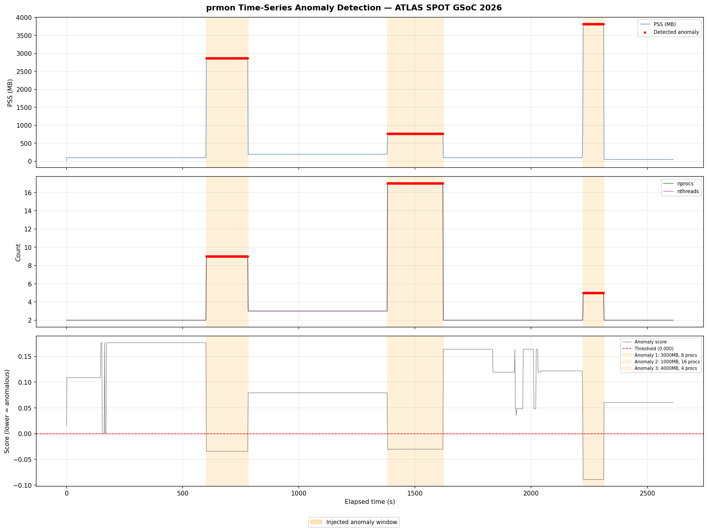
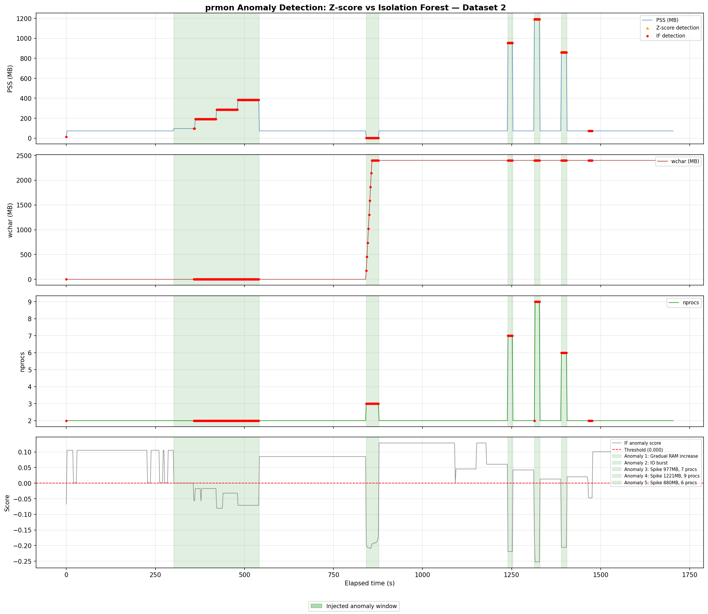

# prmon Anomaly Detection — ATLAS SPOT GSoC 2026

Warm-up exercise for the Automated Software Performance Monitoring for the ATLAS experiment project.

---

## 1. Installing and exploring prmon

I cloned and built prmon from source on Fedora Linux:

```bash
git clone --recurse-submodules https://github.com/HSF/prmon.git
cd prmon && mkdir build && cd build
cmake .. && make -j4
```

The binary ended up at `package/prmon` rather than `bin/prmon`. Running mem-burner directly with a relative path caused an `execvp: No such file or directory` error — prmon couldn't find the child process. The fix was running everything from the `build` directory with the full path via `$(pwd)`, or using the test script from `package/tests/`.

I explored the available burner tools:
```bash
./package/tests/mem-burner --help   # allocates memory, controls procs
./package/tests/io-burner --help    # writes/reads files, controls threads and procs
```

---

## 2. Generating the datasets

I generated two datasets to cover different anomaly scenarios.

### Dataset 1 — large, obvious anomalies

This dataset was a sanity check to verify the detection pipeline before tackling harder cases. The workload runs 7 sequential phases — 3 normal baselines and 3 injected anomalies with memory 15–30x above baseline:

```bash
./package/prmon --interval 1 --filename prmon_dataset.txt -- ./workload.sh
```

| Phase | Type | Parameters | Duration |
|-------|------|------------|----------|
| 1 | Normal | 200MB, 1 proc | 10 min |
| 2 | Anomaly | 3000MB, 8 procs | 3 min |
| 3 | Normal | 400MB, 2 procs | 10 min |
| 4 | Anomaly | 1000MB, 16 procs | 4 min |
| 5 | Normal | 200MB, 1 proc | 10 min |
| 6 | Anomaly | 4000MB, 4 procs | 1.5 min |
| 7 | Cooldown | 100MB, 1 proc | 5 min |

This produced 1307 samples at 2-second intervals.

### Dataset 2 — realistic, harder anomalies

Real software performance anomalies are rarely 30x the baseline. I designed the second workload with three harder anomaly types:

- **Gradual ramp**: memory increases step-by-step (200→400→600→800MB over 4 minutes). A simple threshold misses this.
- **IO burst**: disk write activity spikes while memory stays normal. A memory-only detector misses this entirely.
- **Short spikes**: 15-second bursts (~7–8 samples). Tests whether the model is sensitive enough.

```bash
./package/prmon --interval 1 --filename prmon_dataset2.txt -- ./workload2.sh
```

This produced 853 samples.

I identified the actual anomaly boundaries by watching `nprocs` transitions:
```bash
awk 'NR>1 {print $2, $17}' prmon_dataset2.txt | awk '$2 != prev {print $1, $2; prev=$2}'
```

---

## 3. Anomaly detection

### Dataset 1 — Isolation Forest

For dataset 1, I applied Isolation Forest on 4 features: `pss`, `rss`, `nprocs`, `nthreads`.

I chose Isolation Forest over simpler methods because it handles multivariate data naturally — an anomaly here means both elevated memory *and* elevated process count at the same time, which a single-feature detector wouldn't capture well. It also doesn't assume any particular distribution, which suits prmon's step-function behaviour.

The `contamination` parameter was set from the ground truth ratio rather than guessed:
```python
contamination = n_anomaly / len(df)  # 0.197
```

Results:
```
precision=1.000  recall=0.988  f1=0.994
tp=255  fp=0  fn=3  tn=1049
```

The 3 missed points are at phase transitions where memory briefly overlaps the normal range.



### Dataset 2 — Z-score vs Isolation Forest

For dataset 2, I compared two approaches to show where simple methods fall short.

Z-score was applied to PSS only, flagging points more than 2.5 standard deviations from the mean. Isolation Forest used 6 features: `pss`, `rss`, `nprocs`, `nthreads`, `rchar`, `wchar` — I added `rchar`/`wchar` specifically to give the model a chance to catch the IO burst.

```
Z-score (PSS only):            precision=1.000  recall=0.139  f1=0.243
Isolation Forest (6 features): precision=0.950  recall=0.801  f1=0.869
```

Z-score has perfect precision but recall of 0.139 — it only catches the largest spikes and completely misses the gradual ramp and the IO burst. Isolation Forest catches most anomaly types at the cost of 7 false positives.



---

## 4. Discussion

Isolation Forest worked well here, but there are real trade-offs worth noting.

The biggest practical issue is `contamination`. In this exercise I could set it from ground truth, but in a production monitoring system the true anomaly rate is unknown. You'd need to either tune it empirically or threshold the raw anomaly score instead of relying on the binary prediction.

The model is also not interpretable — it tells you *that* a point is anomalous but not *which* feature caused it. For operational use you'd want to add some kind of contribution analysis on top.

One issue I noticed during data collection: when the IO burst phase ran, prmon logged errors like `attempt to reduce the monitored value of monotonic wchar`. This happens because prmon tracks cumulative I/O aggregated across child processes, and when short-lived processes exit and new ones start, the counters reset. The resulting data is still usable but the wchar column has discontinuities at process boundaries. In a production deployment this would need to be handled explicitly.

---

## 5. Conclusions

Z-score on a single metric is fast and easy to reason about, but fails on gradual drifts, multi-feature anomalies, and short spikes. Isolation Forest handles all three cases at the cost of a small false positive rate and the need to tune `contamination`. For a system like ATLAS SPOT — where workloads are varied and anomalies can appear in many metrics simultaneously — a multivariate approach is the right direction.

---

## AI Disclosure

I used **Claude Sonnet 4.6 (Anthropic)** during this exercise.

**Where I used Claude Sonnet 4.6:**
- Helped generate the initial versions of `analyze.py` and `analyze2.py` (model training loop, evaluation metrics, plotting structure). I reviewed, modified, and ran these myself — for example the initial code produced precision=0/recall=0 which I had to debug independently, and I made the decision to add `rchar`/`wchar` features for dataset 2.
- Helped with parts of the workload scripts (`workload.sh`, `workload2.sh`) — specifically the bash loop structure and prmon invocation syntax. The anomaly types, parameter values, and overall workload design were my own decisions.
- Helped draft and structure this README. The technical content, observations, and conclusions are my own — the writing was collaborative.

**What I did independently:**
- Built prmon from source and worked through the build issues (wrong binary path, execvp error with relative paths)
- Identified the actual anomaly window boundaries by inspecting nprocs transitions with awk
- Debugged the initial model failure — traced it to the contamination parameter not matching the true anomaly ratio
- Noticed and investigated the prmon monotonic counter errors during the IO phase
- Decided to use two datasets and chose the specific anomaly scenarios for dataset 2 based on thinking about what realistic performance anomalies look like
- All code was run, tested, and verified by me
